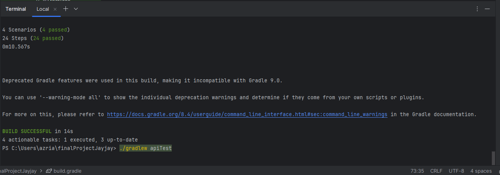
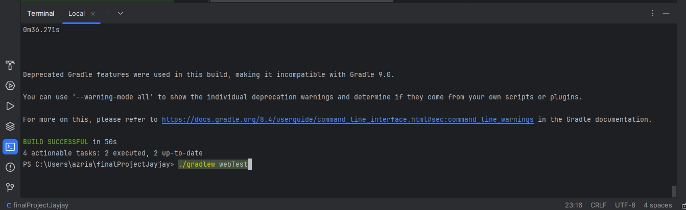

API and Web Automation

This automation uses Selenium Cucumber with Gherkin in Java programming language.

Web UI https://www.demoblaze.com/.
features:
1. Sign up
2. Log in
3. Checkout product
4. Log out

REST API https://dummyapi.io/docs/.
requests:
1. GET users list
2. POST create user
3. PUT update user
4. DELETE update user
5. GET tags list

To execute the automation test, run the workflow in Actions menu.
The test report is under "reports" folder.

Execute result:
1. API Test
2. Web UI Test 